# 🏨 StayEase – Enterprise Accommodation Booking Platform

<div align="center">


</div>

---

# 📖 Project Overview

**StayEase** is an enterprise-grade accommodation booking platform built using **Java 21**, **Spring Boot**, **Spring Cloud Microservices**, **MySQL**, **Spring Security**, and **Gradle**.

The platform enables users to discover, book, and manage accommodations while allowing property owners to manage listings, monitor bookings, and track business performance through dedicated dashboards.

Unlike traditional monolithic booking systems, StayEase follows a **Microservices Architecture**, where every business capability is implemented as an independent service with its own database, business logic, and deployment lifecycle.

The platform demonstrates modern enterprise backend engineering practices including:

- Microservices Architecture
- API Gateway Pattern
- Database per Service Pattern
- JWT Authentication & Authorization
- Email Verification
- Refresh Token Authentication
- Secure Password Management
- OpenFeign Inter-Service Communication
- Circuit Breaker & Retry Mechanisms
- Layered Architecture
- Domain-Driven Design (DDD)
- Spring Security
- Bean Validation
- Global Exception Handling
- Asynchronous Notification Processing
- Payment Gateway Integration (Razorpay)

The architecture has been designed to support future enterprise enhancements including:

- Apache Kafka Event-Driven Communication
- Docker & Docker Compose
- Kubernetes
- Prometheus & Grafana
- Centralized Logging
- Distributed Tracing
- CI/CD Pipelines
- Cloud Deployment (AWS / Azure / GCP)

---

# 🎯 Business Problem

Traditional accommodation booking systems often rely on tightly coupled architectures where authentication, property management, booking, payments, and notifications are implemented within a single application.

Such systems commonly face several challenges:

- Limited scalability as the application grows.
- Tight coupling between business modules.
- Difficult independent deployment of features.
- Single points of failure affecting the entire platform.
- Poor maintainability due to increasing code complexity.
- Limited fault isolation between business domains.
- Challenges integrating new services and technologies.

As user traffic increases, these limitations negatively impact system performance, reliability, and long-term maintainability.

---

# 💡 Business Solution

StayEase addresses these challenges by adopting a modern **Spring Boot Microservices Architecture**.

Each business capability is implemented as an independent microservice responsible for its own business logic and data ownership.

Current services include:

- API Gateway
- Authentication Service
- User Service
- Owner Service
- Property Service
- Booking Service
- Payment Service
- Notification Service

This architecture provides:

- Independent service deployment
- Database per Service
- Improved scalability
- Better fault isolation
- Easier maintenance
- Clear business boundaries
- Simplified future expansion
- Production-oriented architecture

By separating responsibilities across dedicated services, StayEase achieves a scalable, maintainable, and enterprise-ready backend platform capable of supporting future growth and advanced cloud-native capabilities.

---

# 🏛 Enterprise Concepts Demonstrated

StayEase has been designed by following modern enterprise software engineering principles commonly used in large-scale distributed systems.

The project demonstrates practical implementation of the following concepts:

- Microservices Architecture
- API Gateway Pattern
- Database per Service Pattern
- Domain-Driven Design (DDD)
- Layered Architecture
- Spring Security
- JWT Authentication & Authorization
- Refresh Token Authentication
- Email Verification
- Password Encryption (BCrypt)
- Role-Based Access Control (RBAC)
- OpenFeign Inter-Service Communication
- Circuit Breaker Pattern
- Retry Mechanism
- Bean Validation
- Global Exception Handling
- Transaction Management
- Secure Payment Integration (Razorpay)
- Asynchronous Notification Processing
- RESTful API Design
- Environment-Based Configuration
- Enterprise Logging
- Production-Oriented Project Structure

The architecture has also been intentionally designed to support future migration toward an event-driven and cloud-native ecosystem.

---

# 🎯 Project Objectives

StayEase was developed to simulate how a real-world accommodation booking platform would be designed using enterprise backend development practices.

The primary objectives of the project include:

- Build a scalable microservices-based booking platform.
- Separate business domains into independently deployable services.
- Implement secure authentication and authorization.
- Demonstrate enterprise-grade REST API development.
- Integrate online payment processing.
- Provide reliable notification delivery.
- Maintain clear service ownership and database isolation.
- Follow clean architecture and SOLID principles.
- Prepare the platform for future cloud-native deployment.

Beyond implementing business functionality, the project also serves as a practical demonstration of production-oriented software architecture.

---

# ✨ Major Features

StayEase consists of multiple business domains working together to provide a complete accommodation booking experience.

## 🔐 Authentication & Security

- User Registration
- Owner Registration
- Secure Login
- JWT Authentication
- Refresh Token Authentication
- Email Verification
- Forgot Password
- Password Reset
- Logout
- BCrypt Password Encryption
- Role-Based Access Control

---

## 👤 User Management

- User Profile Management
- Profile Picture Upload
- Wishlist Management
- Booking History
- Account Management

---

## 🏢 Owner Management

- Owner Dashboard
- Property Management
- Booking Overview
- Revenue Summary
- Occupancy Statistics

---

## 🏠 Property Management

- Property Registration
- Property Approval Workflow
- Room Management
- Amenities Management
- Property Search
- Property Reviews & Ratings
- Availability Information

---

## 📅 Booking Management

- Property Booking
- Dynamic Availability Calculation
- Booking History
- Booking Cancellation
- Booking Rescheduling
- Check-In & Check-Out Management

---

## 💳 Payment Management

- Razorpay Order Creation
- Secure Payment Verification
- Payment Status Tracking
- Refund Processing
- Receipt Generation
- Payment Retry
- Audit Logging

---

## 📧 Notification Management

- Email Notifications
- Asynchronous Processing
- Automatic Retry
- Exponential Backoff
- Duplicate Notification Detection
- Notification History
- Notification Status Tracking

---

# 🛠 Technology Stack

| Category | Technology |
|------------|------------|
| Language | Java 21 |
| Framework | Spring Boot |
| Microservices | Spring Cloud |
| API Gateway | Spring Cloud Gateway |
| Security | Spring Security, JWT |
| Database | MySQL |
| ORM | Spring Data JPA, Hibernate |
| Build Tool | Gradle |
| Service Communication | OpenFeign |
| Fault Tolerance | Resilience4j |
| Payment Gateway | Razorpay |
| Email | JavaMailSender |
| Validation | Jakarta Bean Validation |
| Documentation | Swagger / OpenAPI |
| Logging | SLF4J |
| Version Control | Git & GitHub |

---

# 🚀 Future Technology Roadmap

The platform has been architected to support additional enterprise technologies with minimal refactoring.

Future enhancements include:

| Category | Planned Technology |
|------------|-------------------|
| Event Streaming | Apache Kafka |
| Containerization | Docker & Docker Compose |
| Container Orchestration | Kubernetes |
| Monitoring | Spring Boot Actuator |
| Metrics | Prometheus |
| Dashboards | Grafana |
| Distributed Tracing | OpenTelemetry & Zipkin |
| Centralized Logging | ELK Stack / Loki |
| CI/CD | GitHub Actions |
| Cloud Deployment | AWS / Azure / GCP |

---

# 🌟 Platform Highlights

✔ Enterprise Microservices Architecture

✔ Eight Independent Microservices

✔ API Gateway

✔ JWT Authentication

✔ Refresh Token Security

✔ Email Verification

✔ Database per Service

✔ Razorpay Payment Integration

✔ Asynchronous Notification Processing

✔ OpenFeign Service Communication

✔ Circuit Breaker & Retry Mechanisms

✔ Enterprise Documentation

✔ Cloud-Native Ready Architecture
---
---

# 🏗 High-Level System Architecture

StayEase follows a **Microservices Architecture**, where each business domain is implemented as an independent service with its own business logic, database, and deployment lifecycle.

All external requests enter the platform through the **API Gateway**, which acts as the single entry point for routing, authentication, and request forwarding.

Business services communicate through secure REST APIs using **OpenFeign**, while each service maintains full ownership of its own data following the **Database per Service** pattern.

Future versions of the platform will extend this architecture with **Apache Kafka** to support asynchronous event-driven communication.

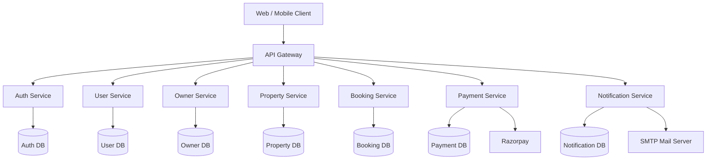

---

# 🧩 Microservices Overview

StayEase is composed of eight independent microservices, each responsible for a specific business capability.

| Service | Primary Responsibility |
|----------|------------------------|
| API Gateway | Entry point, routing, request forwarding |
| Auth Service | Authentication, authorization, JWT, refresh tokens, email verification |
| User Service | User profile management, wishlist, booking history |
| Owner Service | Owner dashboard, property ownership, revenue insights |
| Property Service | Property management, rooms, amenities, search, reviews |
| Booking Service | Booking lifecycle, availability calculation, cancellations |
| Payment Service | Razorpay integration, payment verification, refunds |
| Notification Service | Email notifications, retries, notification history |

Each service can evolve, scale, and be deployed independently without affecting the rest of the platform.

---

# 📋 Service Responsibilities

## 🌐 API Gateway

Responsibilities:

- Single Entry Point
- Request Routing
- Authentication Forwarding
- Centralized Access
- Future Rate Limiting
- Future API Versioning

---

## 🔐 Auth Service

Responsibilities:

- User Authentication
- Owner Authentication
- JWT Generation
- Refresh Token Management
- Email Verification
- Forgot Password
- Password Reset
- Logout
- Role Management

---

## 👤 User Service

Responsibilities:

- User Profile Management
- Wishlist Management
- Booking History
- Profile Picture Upload
- Account Management

---

## 🏢 Owner Service

Responsibilities:

- Owner Dashboard
- Property Ownership
- Booking Monitoring
- Revenue Summary
- Occupancy Statistics

---

## 🏠 Property Service

Responsibilities:

- Property CRUD
- Room Management
- Amenities
- Property Approval
- Search & Filtering
- Reviews & Ratings

---

## 📅 Booking Service

Responsibilities:

- Booking Creation
- Dynamic Availability Calculation
- Booking Cancellation
- Booking Rescheduling
- Check-In
- Check-Out
- Booking History

---

## 💳 Payment Service

Responsibilities:

- Razorpay Order Creation
- Payment Verification
- Refund Processing
- Payment History
- Receipt Generation
- Audit Logging

---

## 📧 Notification Service

Responsibilities:

- Email Notifications
- Async Processing
- Automatic Retry
- Exponential Backoff
- Duplicate Detection
- Notification Tracking

---

# 🔄 End-to-End Request Flow

Every client request follows a structured processing pipeline before reaching the appropriate business service.

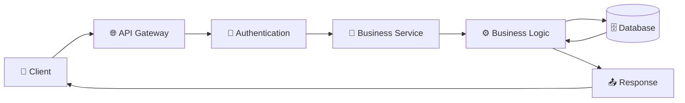

This centralized request flow simplifies security, routing, and future platform expansion.

---

# 🌐 Inter-Service Communication

Business services communicate using **OpenFeign**, enabling synchronous REST-based interactions while keeping service boundaries clearly defined.

Current communication includes:

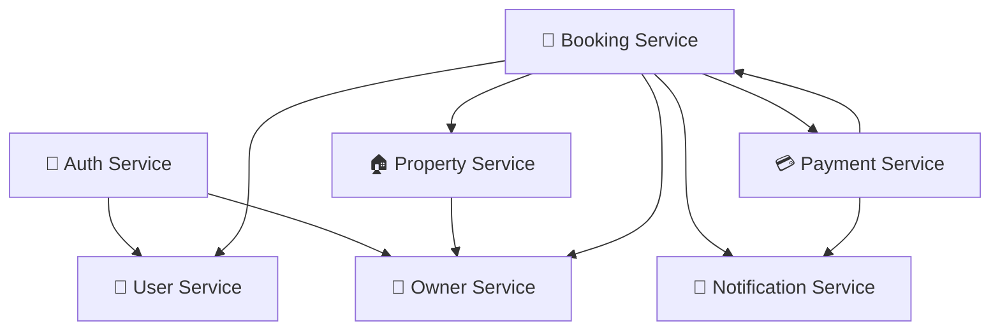

Future versions will gradually introduce **Apache Kafka** for asynchronous event-driven communication where appropriate.

---

# 🗄 Database per Service Architecture

Each microservice owns its own dedicated database.

This architecture prevents tight coupling while allowing independent schema evolution and service scalability.

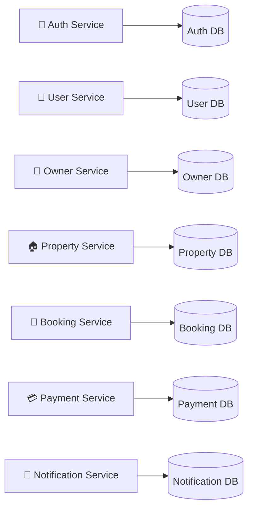

Benefits of this approach include:

- Independent data ownership
- Loose coupling
- Better fault isolation
- Independent database scaling
- Easier schema evolution
- Improved service autonomy

---

# 🔗 External Integrations

StayEase integrates with external services to provide secure payment processing and reliable communication.

| External System | Purpose |
|-----------------|---------|
| Razorpay | Online payment processing |
| SMTP Server | Email notifications |

The architecture has also been prepared for future integrations such as Kafka, Redis, cloud storage providers, and monitoring platforms.

---

# 🔄 End-to-End Business Workflows

StayEase is composed of multiple independent microservices that collaborate to deliver a seamless accommodation booking experience.

Each workflow below illustrates how different services interact to accomplish a specific business operation while maintaining clear separation of responsibilities.

---

# 👤 User Registration Workflow

When a new user registers, the Authentication Service validates the request, creates authentication credentials, sends an email verification link, and provisions the corresponding user profile.

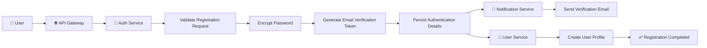

### Workflow Summary

- User submits registration details.
- API Gateway routes the request to the Authentication Service.
- Credentials are validated and securely stored.
- Password is encrypted using BCrypt.
- Email verification token is generated.
- Verification email is sent asynchronously.
- User profile is created in the User Service.
- Registration completes successfully.

---

# 🔐 Login & Authentication Workflow

After successful registration and email verification, users authenticate using their credentials to receive JWT tokens.

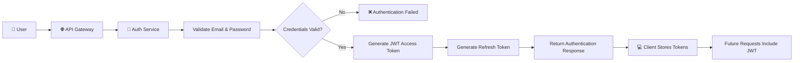

### Workflow Summary

- User submits login credentials.
- Authentication Service validates credentials.
- JWT Access Token is generated.
- Refresh Token is generated.
- Tokens are returned to the client.
- Future API requests use the Access Token for authorization.

---

# 📧 Email Verification Workflow

Email verification ensures that only verified users can activate their accounts and access secured platform features.

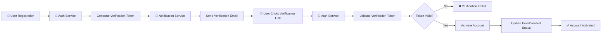

### Workflow Summary

- Verification token is generated during registration.
- Notification Service sends the email.
- User clicks the verification link.
- Authentication Service validates the token.
- User account is activated.
- Email verification status is updated.

---

# 🏠 Property Discovery Workflow

Users can search for accommodations based on location, availability, amenities, pricing, and other business filters.

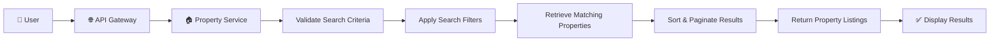

### Workflow Summary

- User searches for accommodations.
- Property Service validates search parameters.
- Filters are applied.
- Matching properties are retrieved.
- Results are sorted and paginated.
- Available properties are returned to the client.

---

# 📌 Key Design Principles Demonstrated

These workflows highlight several enterprise software engineering practices adopted throughout StayEase:

- Microservices Architecture
- API Gateway Pattern
- Layered Architecture
- Database per Service Pattern
- Secure Authentication using JWT
- Email Verification
- Asynchronous Notification Processing
- Loose Coupling Between Services
- Single Responsibility Principle
- Domain-Driven Design (DDD)

Each business capability remains isolated within its own service, enabling independent development, deployment, scalability, and maintenance.
---
---

# 📅 Booking Workflow

Booking a property is one of the core business processes in StayEase. It involves collaboration between multiple microservices to validate the request, calculate availability, create the booking, and initiate payment.

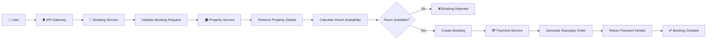

### Workflow Summary

- User submits a booking request.
- Booking Service validates booking details.
- Property Service provides room information.
- Booking Service calculates dynamic availability.
- Booking record is created.
- Payment Service generates a Razorpay order.
- Booking waits for payment confirmation.

---

# 💳 Payment Workflow

Once the booking is created, the Payment Service securely processes the payment using Razorpay.

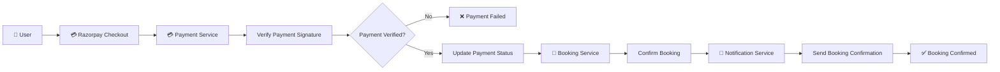

### Workflow Summary

- User completes payment through Razorpay.
- Payment Service verifies the payment signature.
- Booking status is updated.
- Notification Service sends confirmation email.
- Booking becomes confirmed.

---

# 📧 Notification Workflow

Notification delivery is completely independent from business services to improve reliability and responsiveness.

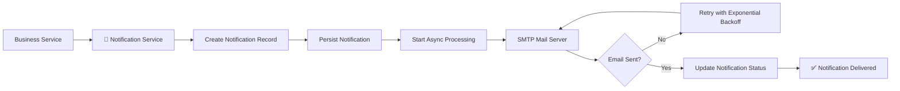

### Workflow Summary

- Business service triggers notification.
- Notification is persisted.
- Email processing occurs asynchronously.
- Failed deliveries are retried automatically.
- Delivery status is tracked.

---

# ❌ Booking Cancellation Workflow

Users can cancel bookings based on business rules and cancellation policies.

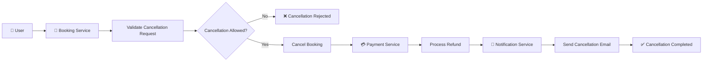

### Workflow Summary

- Booking Service validates cancellation eligibility.
- Booking status is updated.
- Refund is initiated if applicable.
- Customer receives cancellation notification.

---

# 💰 Refund Workflow

Refund processing is handled independently by the Payment Service.

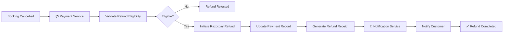

### Workflow Summary

- Payment Service validates refund rules.
- Razorpay refund is initiated.
- Payment history is updated.
- Refund notification is delivered.

---

# 🏢 Owner Management Workflow

Property owners can monitor and manage their business through the Owner Service.

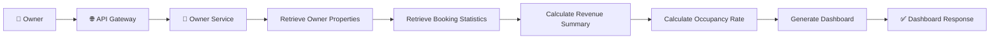

### Workflow Summary

- Owner accesses dashboard.
- Owner Service aggregates business information.
- Revenue and occupancy statistics are calculated.
- Dashboard response is returned.

---

# 🌐 Platform Collaboration Overview

The following diagram illustrates how the primary microservices collaborate to deliver business functionality.

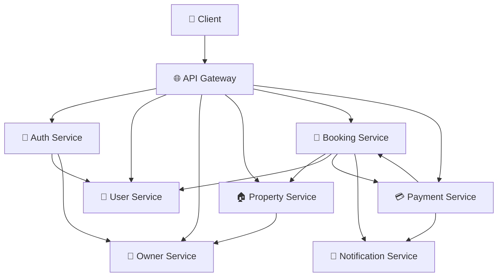

---

# 🌟 Why This Architecture?

StayEase adopts a distributed microservices architecture to achieve scalability, maintainability, and clear business ownership.

### Enterprise Benefits

- ✅ Independent service deployment
- ✅ Database per Service
- ✅ Clear domain boundaries
- ✅ Better scalability
- ✅ Fault isolation
- ✅ Loose coupling
- ✅ Independent technology evolution
- ✅ Easier testing
- ✅ Enterprise-grade maintainability
- ✅ Cloud-native readiness

This architecture enables each microservice to evolve independently while collaborating through well-defined APIs, making StayEase a scalable and production-oriented accommodation booking platform.

---

# 🏛 Enterprise Architecture Decisions

StayEase has been architected using modern software engineering principles to ensure scalability, maintainability, security, and long-term extensibility.

The following sections explain the rationale behind the key architectural decisions adopted throughout the platform.

---

# 🌐 Why Microservices?

StayEase follows a **Microservices Architecture**, where each business capability is implemented as an independent service.

Instead of developing a large monolithic application, responsibilities are separated into specialized services such as Authentication, Property Management, Booking, Payment, and Notification.

### Benefits

- Independent deployment
- Independent scaling
- Better fault isolation
- Easier maintenance
- Clear business ownership
- Faster development cycles
- Technology flexibility
- Cloud-native readiness

---

# 🚪 Why API Gateway?

The **API Gateway** serves as the single entry point for all client requests.

Rather than exposing every microservice directly to external consumers, the gateway centralizes request routing and provides a unified interface.

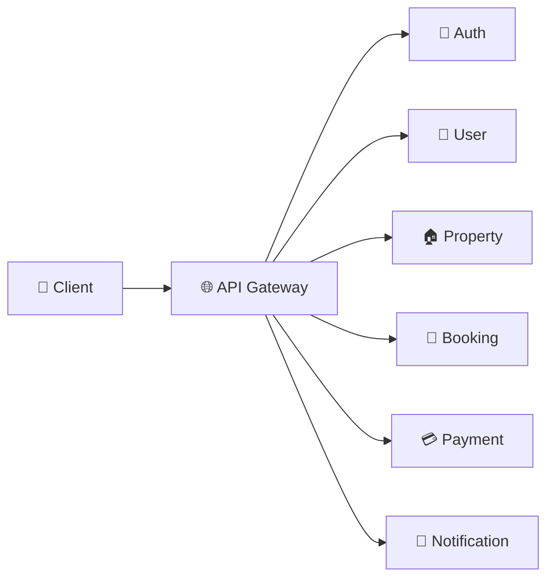

### Benefits

- Single entry point
- Simplified client integration
- Centralized routing
- Security enforcement
- Request forwarding
- Future rate limiting
- Future API versioning

---

# 🗄 Why Database per Service?

Each microservice owns its own dedicated database.

No service accesses another service's database directly.

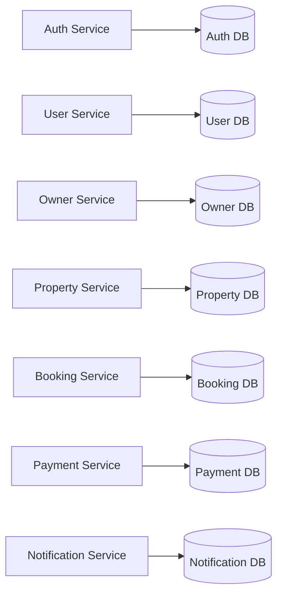

### Benefits

- Loose coupling
- Independent schema evolution
- Better fault isolation
- Independent backups
- Easier scaling
- Better security boundaries

---

# 🔐 Why JWT Authentication?

Authentication is centralized within the Authentication Service.

Once a user successfully logs in, a signed JWT Access Token and Refresh Token are issued.

Business services trust the JWT instead of storing user sessions.

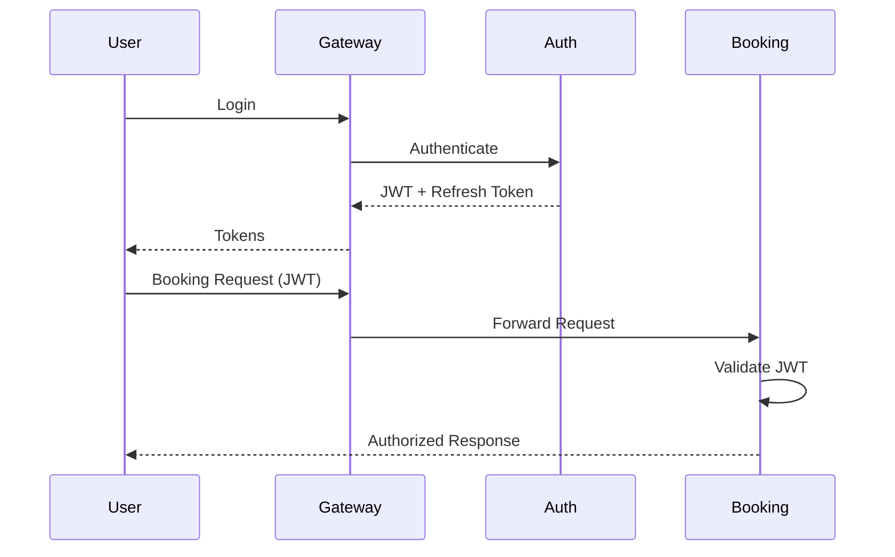

### Benefits

- Stateless authentication
- Horizontal scalability
- Reduced database lookups
- Secure authorization
- Better performance

---

# 📡 Why OpenFeign?

Microservices communicate using **OpenFeign Clients**.

Each service exposes REST APIs while other services consume them through declarative interfaces.

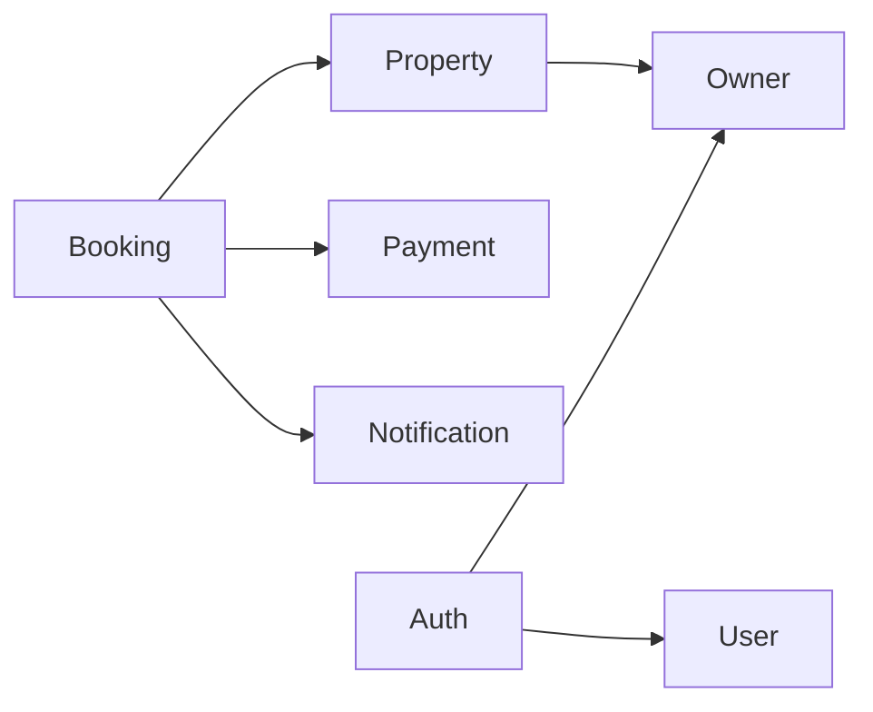

### Benefits

- Simplified REST communication
- Strong typing
- Cleaner code
- Better maintainability
- Easy integration with Resilience4j

---

# 💳 Why a Dedicated Payment Service?

Payment processing is isolated from booking management.

This separation keeps financial transactions independent from booking logic.

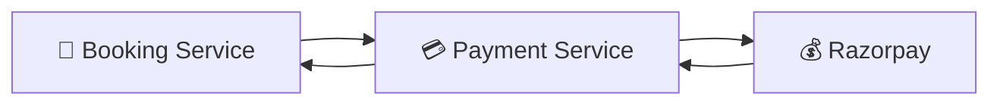

### Responsibilities

- Create payment orders
- Verify payment signatures
- Process refunds
- Track payment history
- Generate receipts

---

# 📧 Why a Dedicated Notification Service?

Notification delivery is separated from core business operations.

This prevents email sending from delaying user-facing operations.

```mermaid
flowchart LR

Business["Business Service"]

Notification["📧 Notification Service"]

SMTP["SMTP Server"]

Business --> Notification

Notification --> SMTP

SMTP --> Notification

Notification --> Business
```

### Responsibilities

- Email notifications
- Retry mechanism
- Exponential backoff
- Delivery tracking
- Duplicate prevention

---

# 🏗 Why Layered Architecture?

Every microservice follows a consistent layered architecture.

```mermaid
flowchart TD

Controller["🌐 Controller"]

Service["⚙️ Service"]

Repository["🗄 Repository"]

Database[("💾 Database")]

Controller --> Service

Service --> Repository

Repository --> Database
```

### Benefits

- Clear separation of concerns
- Easier testing
- Better maintainability
- Improved readability
- Reduced code duplication

---

# 🔄 Why Transaction Management?

Business operations that modify multiple entities are executed within transactional boundaries.

Examples include:

- Booking creation
- Payment verification
- Booking cancellation
- Refund processing

### Benefits

- Atomic operations
- Data consistency
- Rollback support
- Improved reliability

---

# 🛡 Security Principles

Security has been incorporated into every layer of the platform.

Implemented security measures include:

- JWT Authentication
- Refresh Tokens
- BCrypt Password Encryption
- Email Verification
- Role-Based Access Control (RBAC)
- Input Validation
- Global Exception Handling
- Secure Payment Verification
- Protected Internal APIs

Future enhancements include:

- OAuth2
- Multi-Factor Authentication (MFA)
- API Rate Limiting
- Redis Token Blacklisting

---

# 🚀 Production Readiness

StayEase has been designed with production deployment in mind.

Current implementation includes:

- Layered Architecture
- Environment-Based Configuration
- Global Exception Handling
- Centralized Logging
- DTO-Based API Contracts
- Bean Validation
- Service Isolation
- Database per Service

Planned enhancements include:

- Apache Kafka
- Docker
- Kubernetes
- Prometheus
- Grafana
- OpenTelemetry
- Zipkin
- ELK / Loki
- GitHub Actions
- Cloud Deployment

---

# 🌟 Architectural Principles

StayEase follows several enterprise software engineering principles:

- SOLID Principles
- Separation of Concerns
- Single Responsibility Principle
- Domain-Driven Design (DDD)
- Loose Coupling
- High Cohesion
- Stateless Services
- Fail-Fast Validation
- API-First Design
- Secure by Default
- Cloud-Native Ready Architecture

These principles ensure that the platform remains scalable, maintainable, and adaptable as new business requirements emerge.
